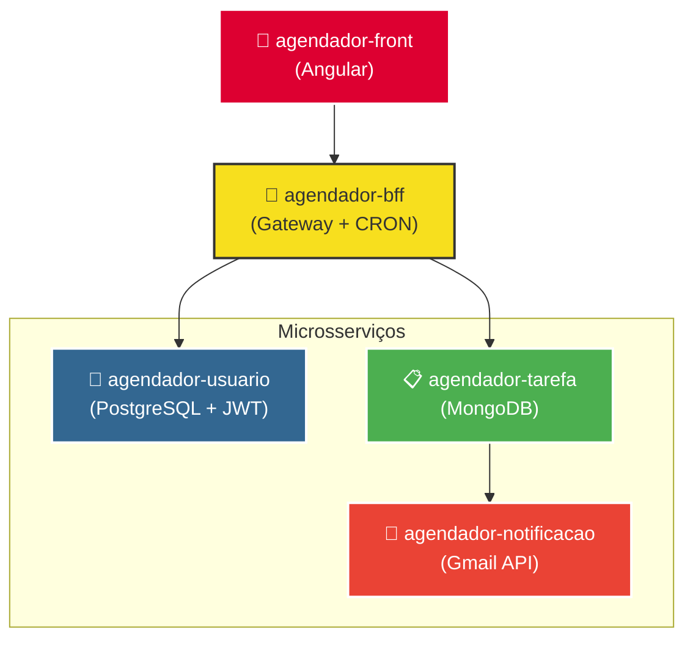

# 👤 Agendador — Serviço de Usuários

> Microsserviço responsável pelo gerenciamento de usuários, autenticação JWT e integração com a API ViaCEP.

---

## 📌 Sobre o Projeto

Serviço central de identidade do ecossistema de agendamento. Expõe endpoints de CRUD de usuários com autenticação baseada em JWT via Spring Security, além de consultar automaticamente o endereço do usuário a partir do CEP informado.

---

## 🏗️ Arquitetura do Ecossistema



---

## 🚀 Tecnologias

| Tecnologia | Finalidade |
|---|---|
| Java / Spring Boot | Base do microsserviço |
| Spring Security + JWT | Autenticação e autorização |
| PostgreSQL | Persistência de dados |
| Spring Data JPA | Mapeamento objeto-relacional |
| ViaCEP API | Consulta de endereço por CEP |
| Spring Web | Exposição de endpoints REST |

---

## ⚙️ Funcionalidades

- [x] Cadastro, leitura, atualização e exclusão de usuários
- [x] Autenticação com geração de token JWT
- [x] Validação e autorização por token nas rotas protegidas
- [x] Consulta automática de endereço via CEP (integração com ViaCEP)
- [x] Persistência em banco PostgreSQL

---

## 📮 Endpoints

### Usuário

| Método | Rota | Acesso | Descrição |
|---|---|---|---|
| `POST` | `/usuario` | Público | Cadastro de novo usuário |
| `POST` | `/usuario/login` | Público | Login e geração de token JWT |
| `GET` | `/usuario?email={email}` | Autenticado | Buscar usuário por e-mail |
| `PUT` | `/usuario` | Autenticado | Atualizar dados do usuário |
| `DELETE` | `/usuario/{email}` | Autenticado | Deletar usuário por e-mail |

### Endereço

| Método | Rota | Acesso | Descrição |
|---|---|---|---|
| `POST` | `/usuario/endereco` | Autenticado | Cadastrar endereço do usuário autenticado |
| `PUT` | `/usuario/endereco?id={id}` | Autenticado | Atualizar endereço por ID |
| `GET` | `/usuario/endereco/{cep}/` | Autenticado | Consultar endereço via ViaCEP |

### Telefone

| Método | Rota | Acesso | Descrição |
|---|---|---|---|
| `POST` | `/usuario/telefone` | Autenticado | Cadastrar telefone do usuário autenticado |
| `PUT` | `/usuario/telefone?id={id}` | Autenticado | Atualizar telefone por ID |

> ⚠️ Rotas autenticadas exigem o header `Authorization: Bearer {token}` retornado pelo endpoint de login.

---

## 🔧 Como Executar

**Opção 1 — Ecossistema completo (recomendado)**

```bash
git clone https://github.com/AndreLuizDSM/agendador-hub.git
cd agendador-hub
docker-compose up
```

**Opção 2 — Apenas este serviço**

Pré-requisitos:
- Java 25 instalado
- PostgreSQL rodando localmente na porta `5432`
- Banco de dados `db_usuario` criado

Configure o `application.properties`:

```properties
spring.datasource.url=jdbc:postgresql://localhost:5432/db_usuario
spring.datasource.username=postgres
spring.datasource.password=1234
spring.jpa.hibernate.ddl-auto=update

secretkey=bWluaGEtY2hhdmUtc2VjcmV0YS1zdXBlci1zZWd1cmEtcXVlLWRldmUtZXN0YS1iZW0tbG9uZ2E=

viacep.url=https://viacep.com.br
```

### Rodando a aplicação

```bash
./mvnw spring-boot:run
```

---

## 📂 Outros Serviços do Ecossistema

| Serviço | Descrição |
|---|---|
| [agendador-tarefa](../agendador-tarefa) | CRUD de tarefas com MongoDB |
| [agendador-notificacao](../agendador-notificacao) | Notificações por e-mail via Gmail API |
| [agendador-bff](../agendador-bff) | Gateway e documentação Swagger |
| [agendador-front](../agendador-front) | Interface Angular |

---
